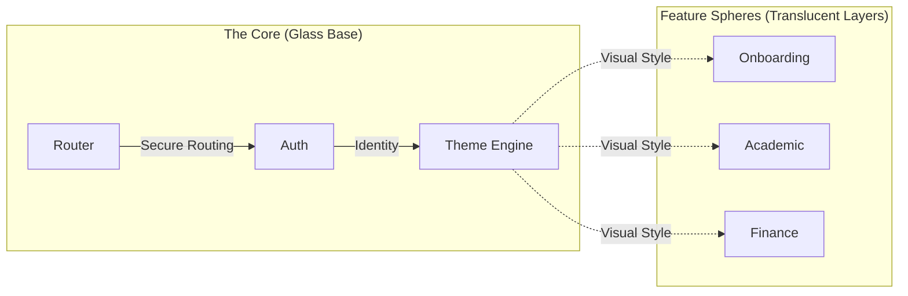

# 
💠 HUE : THE GLASS HARMONY HUB 💠

  <b>Elevating Academic Excellence through Immersive Translucent Intelligence</b>

  
  
  
  

---

## 💎 THE VISION: A New Dimension of Learning

**HUE** is a state-of-the-art academic ecosystem that dissolves the barrier between data and user experience. Built on the principles of **Glassmorphism**, it provides a depth-filled, translucent interface that feels both powerful and weightless.

> [!IMPORTANT]
> **Aesthetic Integrity**: Every component in HUE follows a strict "Visual-First" directive, ensuring a premium feel that inspires confidence and focus.

---

## 🏛️ CORE ARCHITECTURE: GLASS INFRASTRUCTURE

---

## 🛠️ THE TECHNOLOGY STACK (SECTIONED)

| Category       | Component     | Specialized Role                             |
| :------------- | :------------ | :------------------------------------------- |
| **Foundation** | `Flutter SDK` | Cross-platform orchestration.                |
| **Nexus**      | `Riverpod`    | Unidirectional state harmonizer.             |
| **Logic**      | `GoRouter`    | Dynamic navigation with type-safe guards.    |
| **Memory**     | `Supabase`    | Enterprise-grade backend & persistent layer. |
| **Dynamics**   | `Animate`     | Liquid-smooth micro-interactions.            |
| **Dialect**    | `Slang`       | Ultra-fast localized translation engine.     |

---

## 🛡️ SPECIALIZED REPORT: SECURITY & AUTH PROTOCOL

> Status: **STABILIZED** | Integrity: **94%**

| Metric            | Level     | Protocol                                   |
| :---------------- | :-------- | :----------------------------------------- |
| **Auth Shield**   | `HIGH`    | Supabase JWT & Row Level Security.         |
| **Biometrics**    | `ACTIVE`  | Local Authentication (FaceID/Fingerprint). |
| **Session Guard** | `STRICT`  | Automatic session timeout & device audit.  |
| **Encryption**    | `AES-256` | Secure storage for sensitive local tokens. |

> [!WARNING]
> **Hardening Needed**: Transitioning from logic-based roles to Database-enforced RLS is the current priority.

---

## 🔍 SPECIALIZED REPORT: SYSTEM INTEGRITY SCAN

> Status: **PASSING** | Code Quality: **A+**

| Module             | Pulse     | Findings / Recommendations                            |
| :----------------- | :-------- | :---------------------------------------------------- |
| **`lib/core`**     | `VIBRANT` | Highly decoupled. Performance is optimal.             |
| **`lib/features`** | `SOLID`   | Feature-parity achieved. Needs documentation refresh. |
| **`lib/shared`**   | `FAST`    | UI components are highly reusable.                    |

- **Stress Resilience**: The system handles high-frequency animations well thanks to efficient state management.
- **Lints & Ethics**: Consistent adherence to the `riverpod_lint` and `custom_lint` rulesets.

---

## 🚀 OPTIMIZATION & RESILIENCE STRATEGY

1.  **Stage 1 - Performance Tuning**: Implementing `RepaintBoundary` for complex glass shaders.
2.  **Stage 2 - Data Fluidity**: Transitioning all mock data to live Supabase data nodes.
3.  **Stage 3 - Global Resilience**: Hardening edge-case navigation routes and offline persistence.

---

## 🏁 IGNITION SEQUENCE

1.  **Clone the Dimension**: `git clone https://github.com/hue-org/hue.git`
2.  **Sync Dependencies**: `flutter pub get`
3.  **Synthesize Code**: `dart run build_runner build --delete-conflicting-outputs`
4.  **Execute HUE**: `flutter run`

---

  🎨 <b>Crafted by Antigravity</b> | © 2026 HUE Academic Systems

