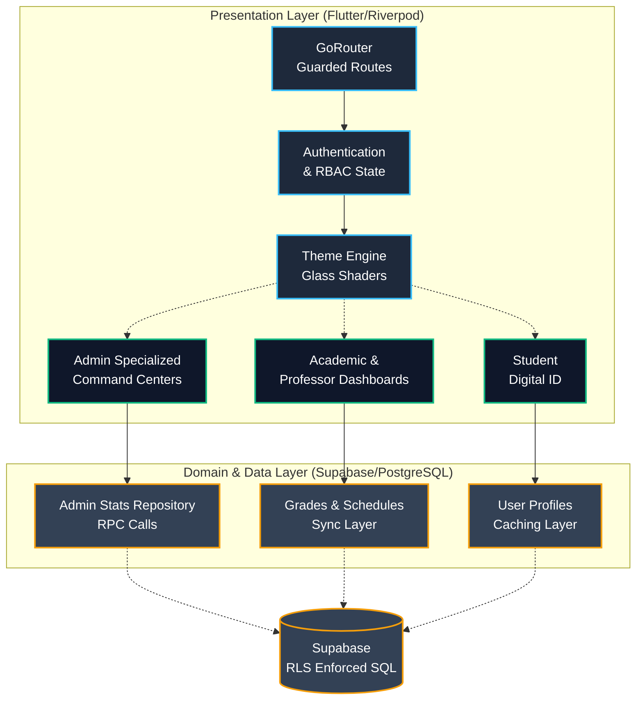

# <p align="center"> HUE : THE GLASS HARMONY HUB </p>

<p align="center">
  <b>Elevating Academic Excellence through Immersive Translucent Intelligence</b>
  <br>
  <b>الارتقاء بالتميز الأكاديمي من خلال الذكاء الانسيابي الغامر</b>
</p>

<p align="center">
  
  
  
  
  
  
</p>

---

## 💎 THE VISION | الرؤية

**HUE** is a state-of-the-art enterprise academic management ecosystem designed to dissolve the barrier between complex institutional data and user experience. By leveraging cutting-edge UI paradigms, strict typing, and high-performance cross-platform rendering, HUE delivers a zero-latency command center customized for every academic role.

**HUE** هو نظام أكاديمي متطور على مستوى المؤسسات صُمم ليذيب الحواجز بين البيانات المؤسسية المعقدة وتجربة المستخدم. بالاستفادة من أحدث نماذج واجهات المستخدم، والأنواع الصارمة، والعرض عالي الأداء عبر المنصات، يوفر HUE مركز قيادة فوري مخصص لكل دور أكاديمي.

---

## 🏛️ CORE ARCHITECTURE | الهيكل التقني

HUE utilizes a strictly isolated Feature-Driven Architecture (FDA) decoupled by robust routing and dependency injection layers.



---

## 🛠️ TECHNOLOGY STACK | الحزمة التقنية

| Domain            | Core Component    | Strategic Role                                                                                |
| :---------------- | :---------------- | :-------------------------------------------------------------------------------------------- |
| **Orchestration** | `Flutter 3.x`     | Cross-platform UI compilation engine utilizing Impeller.                                      |
| **State Nexus**   | `Riverpod`        | Unidirectional reactive state harmonizer using `AsyncNotifier` patterns.                      |
| **Navigation**    | `GoRouter`        | Imperative/Declarative routing with deep linking and RBAC (Role-Based Access Control) guards. |
| **Data Memory**   | `Supabase`        | Enterprise-grade backend for PostgreSQL, Edge Functions, and Row Level Security (RLS).        |
| **Localization**  | `Slang`           | Ultra-fast compile-time i18n engine with strict type checking.                                |
| **Aesthetics**    | `Glassmorphism`   | Complex `BackdropFilter` shaders and synchronized animations (`flutter_animate`).             |
| **Security**      | `AXE Fingerprint` | Proprietary compile-time security tracking and access validation.                             |

---

## 🏗️ COMPREHENSIVE SYSTEM MODULES | وحدات النظام الشاملة

HUE encompasses a wide range of specialized modules built to empower every member of an academic institution:
يتضمن HUE مجموعة واسعة من الوحدات المتخصصة المصممة لتمكين كل فرد في المؤسسة الأكاديمية:

### 🛡️ Administration Command Centers (إدارة النظام)

Completely rebuilt with isolated, highly-specialized screens for granular control:

- **Student Management**: Advanced filtering by GPA, warnings, and real-time status.
- **Staff & Faculty Management**: Real-time quota monitoring, performance, and role assignment targeting.
- **Academic Leadership**: Dedicated portal for Deans and Department Heads with structural hierarchy mapping.
- **Admin & IT**: Server health metrics, internal audit logs, roles management, and infrastructure monitoring.
- **Structure Management**: Specialized dashboards for Colleges and Departments.

### 📚 Academic Ecosystem (النظام الأكاديمي الشامل)

- **Professor Dashboards**: Complete class overview, real-time subject results, scheduling, and direct chat.
- **Student Academic Progress**: Detailed GPA tracking, action plans, and complete transcript integration.
- **Courses & Grades**: Manage and track all subjects, grades, and continuous assessments seamlessly.
- **Attendance & Scheduling**: Real-time class attendance logging, comprehensive daily schedules, and exam timetables.
- **TA Management**: Manage teaching assistants and their associated groups.

### 🪪 Digital Identification & Students (الهوية الرقمية والطلاب)

- **3D Interactive NFC Cards**: Gyroscope-driven holographic passes generated uniquely per student via hardware orientation sensors.
- **Real-time Access Control**: Offline/Online hybrid verification for campus entry.
- **Onboarding & Welcome Flow**: Engaging and smooth initial setup for new users.

### ⚙️ User Settings & Profiling (إعدادات المستخدم والملف الشخصي)

- **Glassmorphic Profile Management**: High-end user profile editing with floating components.
- **Modular Theming**: Dynamic App Styles with built-in Light/Dark mode and structural RTL/LTR adaptations natively.
- **Privacy & Security**: Native password management and strict privacy policies enforcement.

---

## 🚀 ROADMAP: FUTURE IMPROVEMENTS | التحسينات المستقبلية

We are continually expanding HUE to support high-performance media, physical infrastructure integration, and real-time interaction:
نحن نعمل باستمرار على توسيع HUE لدعم الوسائط عالية الأداء، وتكامل البنية التحتية، والتفاعل في الوقت الفعلي:

### 📹 Edge Media & Broadcasting | الوسائط الذكية والبث

- **Video Recording & Telemetry**: High-quality local/cloud recording of active sessions with spatial audio.
- **Live Streaming (بث مباشر)**: WebRTC-powered real-time broadcasting capabilities for keynote events.
- **Online Lectures (محاضرات أونلاين)**: Dedicated low-latency virtual classroom environment with interactive whiteboarding.

### 🔐 Physical Security & Infrastructure | الأمان المادي والبنية التحتية

- **NFC/RFID Turnstile Integration**: Direct handshake protocols from the HUE Digital ID to campus gates.
- **IoT Classrooms**: Automated environmental controls in lecture halls via instructor dashboards.

### 🤖 Advanced AI Features | ميزات الذكاء الاصطناعي المتقدمة

- **Predictive Academic Analytics**: AI models to predict student performance drops and suggest preemptive action plans.
- **Automated Scheduling**: AI-driven conflict-free timetable generation tailored for faculty availability and room capacities.

---

## 🏁 IGNITION SEQUENCE | بداية التشغيل

To initialize the development environment locally:

1. **Clone Repository**:
   ```bash
   git clone https://github.com/hue-org/hue.git
   ```
2. **Synchronize Dependencies**:
   ```bash
   flutter pub get
   ```
3. **Synthesize Code Generation** (Crucial for Riverpod & Slang):
   ```bash
   dart run build_runner build --delete-conflicting-outputs
   ```
4. **Execute Engine**:
   ```bash
   flutter run
   ```

---

<p align="center">
  <b>Architected for Excellence</b><br>
  🎨 Developed by <b>GT Team</b> | © 2025 HUE Academic Systems
</p>
