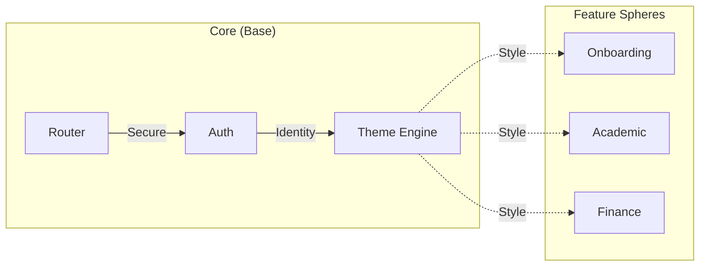

# 
 HUE : THE GLASS HARMONY HUB 

  <b>Elevating Academic Excellence through Immersive Translucent Intelligence</b>
   
  <b>الارتقاء بالتميز الأكاديمي من خلال الذكاء الانسيابي الغامر</b>

  
  
  
  

---

## 💎 THE VISION | الرؤية

**HUE** is a state-of-the-art academic ecosystem that dissolves the barrier between data and user experience.
**HUE** هو نظام أكاديمي متطور يذيب الحواجز بين البيانات وتجربة المستخدم.

> [!IMPORTANT]
> **Aesthetic Integrity | النزاهة الجمالية**:
> Every component in HUE follows a strict "Visual-First" directive, ensuring a premium feel.
> كل مكون في HUE يتبع توجيهاً صارماً "البصر أولاً"، مما يضمن شعوراً متميزاً.

---

## 🏛️ CORE ARCHITECTURE | الهيكل الأساسي

---

## 🛠️ TECHNOLOGY STACK | التقنيات المستخدمة

| Category       | Component     | Role                             |
| :------------- | :------------ | :------------------------------- |
| **Foundation** | `Flutter SDK` | Cross-platform orchestration.    |
| **Nexus**      | `Riverpod`    | Unidirectional state harmonizer. |
| **Logic**      | `GoRouter`    | Dynamic navigation & guards.     |
| **Memory**     | `Supabase`    | Enterprise-grade backend.        |
| **Dialect**    | `Slang`       | Ultra-fast i18n engine.          |

---

## 🏗️ PROGRESS REPORT | تقرير التقدم (WIP)

### Modernization & Hardening | التحديث والتحصين

> Current overall completion: **~85%**

- **[60%] Security Architecture**: Transitioning to Database-enforced RLS (Row Level Security).
- **[75%] Academic Module**: Migrating legacy `StateProvider` to modern `Notifier` API.
- **[90%] Data Fluidity**: Moving from local mock structures to live Supabase nodes.
- **[80%] UI/UX Refinement**: Implementing `RepaintBoundary` for complex glass shaders.

---

## 🚀 ROADMAP: THE FUTURE | خارطة الطريق: المستقبل

We are currently expanding HUE to support high-performance media and real-time interaction:
نحن نعمل حالياً على توسيع HUE لدعم الوسائط عالية الأداء والتفاعل في الوقت الفعلي:

### 📹 Media Excellence | تميز الوسائط

- **Video Recording**: High-quality local and cloud recording of sessions.
- **بث مباشر (Live Streaming)**: Real-time broadcasting capabilities for events.
- **بث فيديو (Video Broadcasting)**: High-definition video content distribution.
- **محاضرات أون لاين (Online Lectures)**: Dedicated virtual classroom environment with interactive tools.

---

## 🏁 IGNITION SEQUENCE | التشغيل

1. **Clone**: `git clone https://github.com/hue-org/hue.git`
2. **Sync**: `flutter pub get`
3. **Synthesize**: `dart run build_runner build --delete-conflicting-outputs`
4. **Execute**: `flutter run`

---

  🎨 <b>Developed by GT-Axe Team</b> | © 2025 HUE Academic Systems

